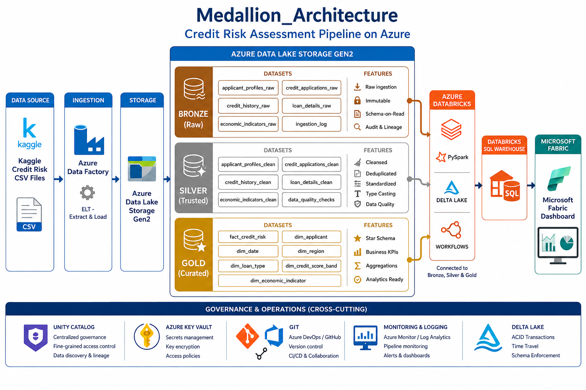
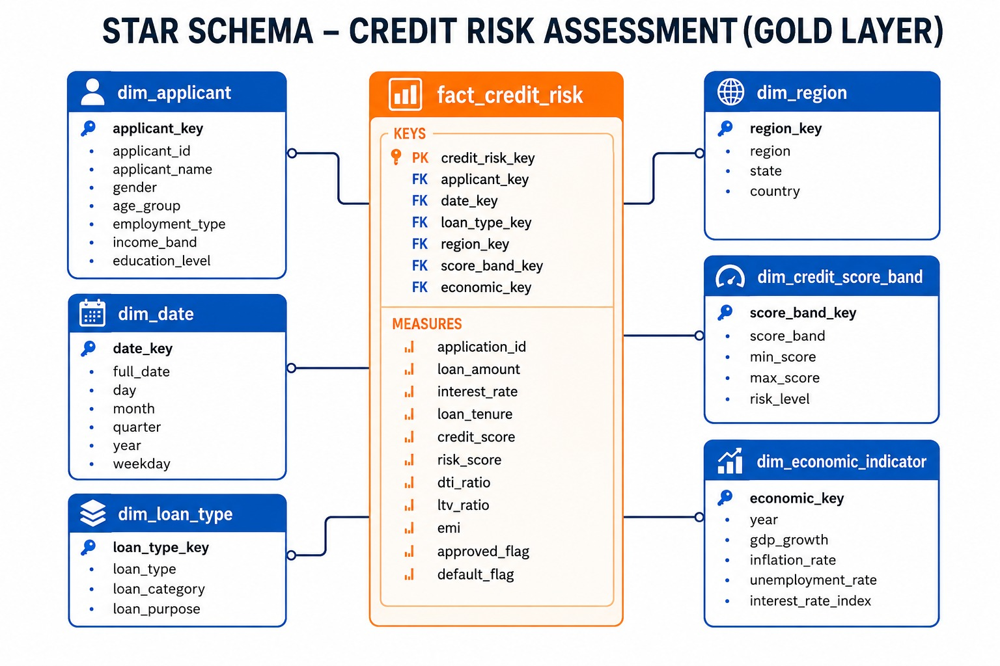
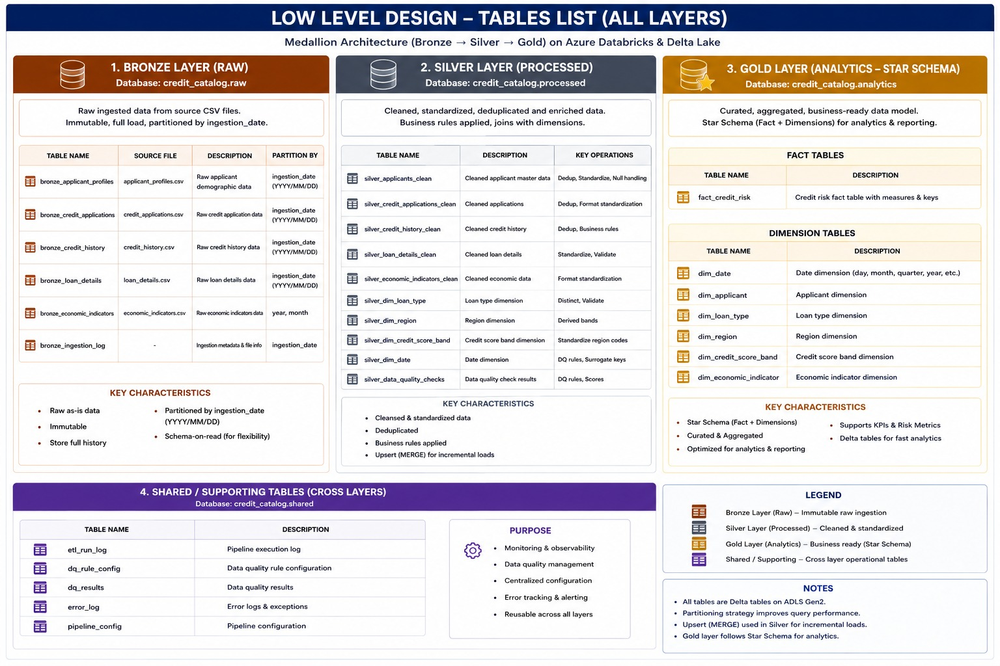

# Credit Risk Assessment Pipeline using Azure Data Factory, Azure Databricks & Microsoft Fabric


---

# 📌 Project Overview

This project implements an **Enterprise End-to-End Credit Risk Assessment Pipeline** using Microsoft Azure services following the **ELT (Extract, Load, Transform)** approach and **Medallion Architecture (Bronze → Silver → Gold)**.

The solution ingests credit risk data from CSV files, converts them into Parquet format using Azure Data Factory, stores them in Azure Data Lake Storage Gen2, processes them using Azure Databricks and Delta Lake, builds analytical Star Schema tables, and visualizes business insights using Microsoft Fabric / Power BI.

---

# 🏢 Business Problem

Financial institutions receive thousands of loan applications every day.

Manual verification is slow and inconsistent.

The objective is to build a scalable platform that:

- Automates data ingestion
- Cleans and validates data
- Calculates credit risk
- Generates analytical datasets
- Produces business dashboards
- Enables better loan approval decisions

---

# 🏗️ High Level Architecture

<p align="center">
  
</p>

---

# ⚙️ Low Level Architecture

<p align="center">
  
</p>

---

# 🥉🥈🥇 Medallion Architecture

<p align="center">
  
</p>

---

# ⭐ Star Schema

<p align="center">
  
</p>

---

# 📋 Tables List

<p align="center">
  
</p>

---

# 🚀 Technology Stack

| Layer | Technology |
|--------|------------|
| Cloud | Microsoft Azure |
| Data Ingestion | Azure Data Factory |
| Storage | Azure Data Lake Storage Gen2 |
| Processing | Azure Databricks |
| Programming | PySpark |
| Storage Format | Delta Lake |
| Governance | Unity Catalog |
| SQL Engine | Databricks SQL Warehouse |
| Dashboard | Microsoft Fabric |
| Reporting | Power BI |
| Version Control | Git |
| CI/CD | Azure DevOps |

---

# 📂 Source Dataset

The project uses five source datasets.

```text
applicant_profiles.csv
credit_applications.csv
credit_history.csv
loan_details.csv
economic_indicators.csv
```

---

# 📁 Repository Structure

```text
Credit_risk_analysis_p2
│
├── ARCHITECTURE
│   ├── credit risk analysis_HLD.png
│   ├── credit risk analysis_Low level.png
│   ├── Medallion_Architecture.png
│   ├── STAR_SCHEMA.jpeg
│   └── Tabels_list.jpeg
│
├── DATASETS
├── DBT
├── Development
├── slack
├── README.md
└── ...
```

---

# 📊 Dashboard

The dashboard is developed using:

- Microsoft Fabric
- Power BI
- Databricks SQL Warehouse

Reports include:

- Credit Risk Dashboard
- Executive Dashboard
- Customer Dashboard
- Regional Dashboard
- Risk Trend Analysis

---

# 🔐 Security & Governance

- Unity Catalog
- Azure Key Vault
- Managed Identity
- RBAC
- Audit Logging
- Data Lineage

---

# 🧪 Testing

- Unit Testing
- Integration Testing
- Data Validation
- Business Rule Validation
- Schema Validation

---

# 👨‍💻 Author

**Gandikota Mounika**

Azure Data Engineer
